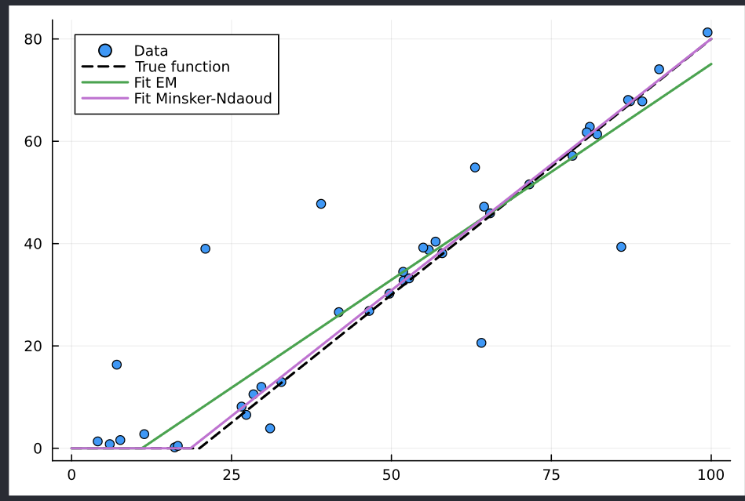

# RobustMeans

The aim of this package is to implement in Julia some robust mean estimators (one-dimensional for now).
See [Mean Estimation and Regression Under Heavy-Tailed Distributions: A Survey](https://arxiv.org/pdf/1906.04280.pdf) or [The Robust Randomized Quasi Monte Carlo method, applications to integrating singular functions](https://cnrs.hal.science/CMAP/hal-03631879v3) for recent surveys.

> [!NOTE]
> Computing the empirical mean over a data set is one of the most common operations in data analysis. However, this operation is not robust to outliers or contaminated samples.
> Robust mean estimators are mean estimators that are ``robust`` (in some sense) against such outliers or contaminated samples.

**I am currently trying some stuff on the package about "robust moving average"**

## Example: Comparing robust estimator vs Empirical Means

```julia
using Distributions
using RobustMeans
```

### Generate samples

```julia
n = 8 * 7
M = 10^5 # M = 10^7 is used for the plot
α = 3.1
distribution = Pareto(α)
μ = mean(distribution) # True mean
σ = std(distribution) # True std
x = rand(distribution, M, n) # M realizations of samples of size n
```

### Estimate the mean with different estimators

```julia
# Store all the realizations into a Dictionary
p = 1 # Parameter of Minsker-Ndaoud
δ = 3exp(-8) # 0.001
estimators = [EmpiricalMean(), Catoni(σ), Huber(σ), LeeValiant(), MinskerNdaoud(p)]
short_names = ["EM", "CA", "HU", "LV", "MN"]
estimates = Dict{MeanEstimator,Vector}()
for estimator in estimators
    estimates[estimator] = [mean(r, δ, estimator) for r in eachrow(x)]
end
```

### Plot

```julia
using StatsPlots, LaTeXStrings
gr()
plot_font = "Computer Modern" # To have nice LaTeX font plots.
default(
    fontfamily = plot_font,
    linewidth = 2,
    label = nothing,
    grid = true,
    framestyle = :default
)
# The plot 
begin
    plot(thickness_scaling = 2, size = (1000, 600))
    plot!(Normal(), label = L"\mathcal{N}(0,1)", c = :black, alpha = 0.6)
    for (ns, s) in enumerate(estimators)
        W = √(n) * (estimates[s] .- μ) / σ
        stephist!(W, alpha = 0.6, norm = :pdf, label = short_names[ns], c = ns)
        vline!([quantile(W, 1-δ)], s = :dot, c = ns)
    end

    vline!([0], label = :none, c = :black, lw = 1, alpha = 0.9)
    yaxis!(:log10, yminorticks = 9, minorgrid = :y, legend = :topright, minorgridlinewidth = 1.2)
    ylims!((1/M*10, 2))
    ylabel!(L"\sqrt{n}(\hat{\mu}_n-\mu)/\sigma", tickfonthalign = :center)
    xlims!((-5, 10))
    yticks!(10.0 .^ (-7:-0))
end
```


## Example: Robust nonlinear regression

Let's say you have a nonlinear regression problem $Y = f(u, X) + \epsilon$, where $\epsilon$ can be heavy-tailed or corrupted samples.
The function is parametrized by the vector $u$ of parameters you want to adjust.

Traditionally, one would try to solve the following optimization problem
```math
u^\ast_{\mathrm{EM}} = \operatorname{\argmin}_u \dfrac{1}{N}\sum_{i=1}^N (y_i - f(u, x_i))^2
```
However, this empirical mean could be heavily influenced by data outliers.
To perform robust regression, one could use
```math
u^\ast_{\mathrm{robust}} = \operatorname{\argmin}_u \text{RobustMean}\left(\left\{(y_i - f(u, x_i))^2\right\}_{i\in [\![1, N]\!]}\right)
```

> [!NOTE]
> Note that when $f$ is linear, you can use the dedicated package [RobustModels.jl](https://github.com/getzze/RobustModels.jl), which has many more robust estimators and a better interface. However, it does lack some of the more theoretical ones written here and most importantly it is currently limited to linear models.

In the following example, we use the Minsker-Ndaoud robust estimator and $f$ is a $\mathrm{relu}$ function. 
We choose Minsker-Ndaoud because it is compatible with automatic differentiation. Note that Catoni/Huber should also be easily differentiable; for the MoM-based estimator, I am not sure...

First, here is the set up

```julia
using RobustMeans
using Plots

using Optimization
using ForwardDiff

relu(x, a, b) = x > b ? a * (x - b) : zero(x)
N = 8*5
X = 100rand(N)
a_true = 1
b_true = 20
Y = abs.(relu.(X, a_true, b_true) + 2randn(N))

# We manually corrupt the dataset
percentage_outliers = 0.17
n_outliers = round(Int, percentage_outliers * length(X))
Y[1:n_outliers] = maximum(Y)*rand(n_outliers) .+ minimum(Y)

# just so δ is a multiple of the number of data points    
δ = 3exp(-8)


u0 = [0.2, 18]
p = [X, Y]
```

For comparison, let's try the regular regression

```julia
f_err_EM(u, p) = mean((relu.(p[1], u[1], u[2]) - p[2]).^2, δ, EmpiricalMean())

optf_EM = OptimizationFunction(f_err_EM, AutoForwardDiff())
prob_EM = OptimizationProblem(optf_EM, u0, p)

sol_EM = solve(prob_EM, Optimization.LBFGS())
```

Now the robust regression

```julia
f_err_R(u, p) = mean((relu.(p[1], u[1], u[2]) - p[2]).^2, δ, MinskerNdaoud(2))

optf_R = OptimizationFunction(f_err_R, AutoForwardDiff())
prob_R = OptimizationProblem(optf_R, u0, p)

sol_R = solve(prob_R, Optimization.LBFGS())
```

```julia
Xl = 0:0.1:100
scatter(X, Y, label="Data")
plot!(Xl, relu.(Xl, a_true, b_true), label="True function", lw = 2, s = :dash, c = :black)
plot!(Xl, relu.(Xl, sol_EM.u...), lw = 2, label = "Fit EM")
plot!(Xl, relu.(Xl, sol_R.u...), lw = 2, label = "Fit Minsker-Ndaoud")
```
