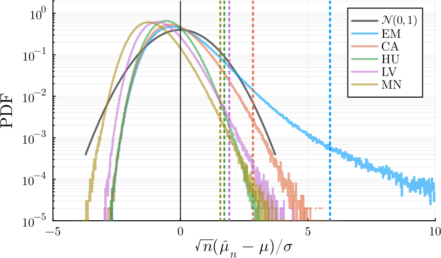

# RobustMeans

This package aim is to implement in Julia some (one-dimensional for now) robust mean estimators.
See [Mean Estimation and Regression Under Heavy-Tailed Distributions: A Survey](https://arxiv.org/pdf/1906.04280.pdf) for a recent but but not up to date since the field is very active) survey.

## What is it about?

Computing the empirical mean over a data set is one of the most common operations in data analysis.
However, this operation is not robust to outliers or contaminated samples.
Robust mean estimators are mean estimator that are ``robust`` (in some sense) against such outliers or contaminated samples.

## Example

```julia
using Distributions
using RobustMeans
```

### Generate samples

```julia
n = 8 * 7
M = 10^5 # M = 10^7 is used for the plot
α = 3.1
distribution = Pareto(α)
μ = mean(distribution) # True mean
σ = std(distribution) # True std
x = rand(distribution, M, n) # M realization of samples of size n
```

### Inference

```julia
# Store all the realizations into a Dictionary
p = 1 # Parameter of MinskerNdaoud
δ = 3exp(-8) # 0.001
estimators = [EmpiricalMean(), Catoni(σ), Huber(σ), LeeValiant(), MinskerNdaoud(p)]
short_names = ["EM", "CA", "HU", "LV", "MN"]
estimates = Dict{MeanEstimator,Vector}()
for estimator in estimators
    estimates[estimator] = [mean(r, δ, estimator) for r in eachrow(x)]
    end
```

### Plot

```julia
# To have nice LaTeX font plots.
using StatsPlots, LaTeXStrings
gr()
plot_font = "Computer Modern"
default(
    fontfamily = plot_font,
    linewidth = 2,
    label = nothing,
    grid = true,
    framestyle = :default
)
# The plot 
begin
    plot(thickness_scaling = 2, size = (1000, 600))
    plot!(Normal(), label = L"\mathcal{N}(0,1)", c = :black, alpha = 0.6)
    for (ns, s) in enumerate(estimators)
        W = √(n) * (estimates[s] .- μ) / σ
        stephist!(W, alpha = 0.6, norm = :pdf, label = short_names[ns], c = ns)
        vline!([quantile(W, 1-δ)], s = :dot, c = ns)
    end

    vline!([0], label = :none, c = :black, lw = 1, alpha = 0.9)
    yaxis!(:log10, yminorticks = 9, minorgrid = :y, legend = :topright, minorgridlinewidth = 1.2)
    ylims!((1/M*10, 2))
    ylabel!(L"\sqrt{n}(\hat{\mu}_n-\mu)/\sigma", tickfonthalign = :center)
    xlims!((-5, 10))
    yticks!(10.0 .^ (-7:-0))
end
```

